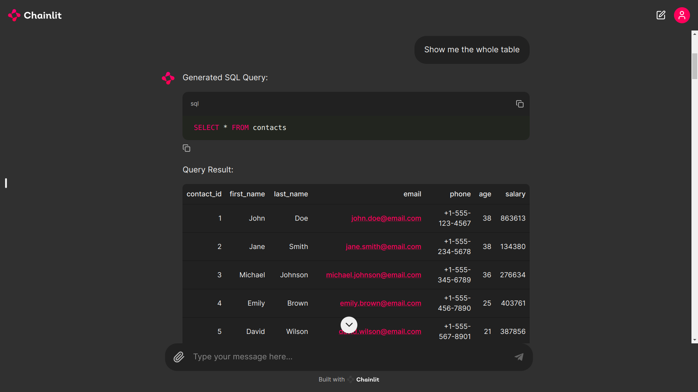

# NaturalQuery Executor

## Overview



**NaturalQuery Executor** is a sophisticated tool designed to simplify interactions with databases by converting natural language queries into executable SQL commands. It not only generates SQL queries from user inputs but also directly executes them on the connected database and returns the results. This project integrates advanced AI models with database management, offering a seamless way to interact with and manipulate data.

## Features

- **Natural Language Processing**: Converts user queries in natural language into SQL commands.
- **Direct Database Interaction**: Executes SQL queries directly on the database and returns results.
- **Dynamic Query Execution**: Handles various types of SQL commands including SELECT, INSERT, UPDATE, and DELETE.
- **User-Friendly Interface**: Provides a conversational interface for easy interaction and query execution.

## Components

### 1. `text_to_query.py`

This module contains the `Text_to_query` class which:
- Loads and configures an AI model for text-to-SQL conversion.
- Converts natural language inputs into SQL queries.

### 2. `dbms_integration.py`

This module contains the `Query_execution` class which:
- Connects to a SQLite database.
- Executes SQL queries and returns results or success messages.

### 3. `app.py`

This module:
- Integrates `Text_to_query` and `Query_execution` into a user-friendly application using Chainlit.
- Handles user interactions, generates SQL queries, executes them, and displays results.

## Installation

To set up the Text-to-SQL Converter, follow these steps:

1. Clone the repository:
```commandline
git clone https://github.com/majipa007/NaturalQuery-Executor-Using-Phi-3.git
cd NaturalQuery-Executor-Using-Phi-3
```


2. Install dependencies:
```commandline
pip install -r requirements.txt
```

## Usage

To launch the application:

1. Run the following command:
```commandline
chainlit run chainlit.py -w
```
2. Open a web browser and navigate to `http://localhost:8000`

3. Input your query in natural language in the chat interface

4. The system will generate and execute the corresponding SQL query

## Technical Architecture

The Text-to-SQL Converter is built on the following technologies:

- Hugging Face Transformers
- Chainlit
- Python
- SQLite

Key components include:

1. Text_to_database Class: Manages model initialization, query generation, and database operations
2. Chainlit Integration: Provides the interactive user interface
3. Query Processing Pipeline: Handles natural language input, SQL generation, and query execution

## Contributing

We welcome contributions to the Text-to-SQL Converter project.

## License

This project is licensed under the MIT License.

## Acknowledgements

We extend our gratitude to the developers and researchers behind the language model (Microsoft and Unsloth), Dataset (https://huggingface.co/b-mc2) and libraries that power this application.

---

